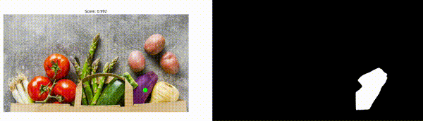
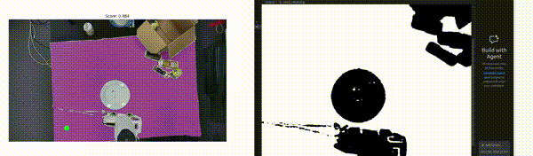

## 🎥 Demonstration Videos

### 🛒 Multiple Grocery Item Segmentation
[](assets/grocessry_items.webm)

This demonstration shows segmentation of **multiple grocery items** within a single image and the generation of corresponding **binary masks**, suitable for downstream robotic manipulation tasks.

---

### 🤖 Vision-Based Robotic Object Grasping
[](assets/object_picking.webm)

This demonstration illustrates **vision-based image segmentation for robotic grasping**, enabling a manipulator to accurately identify a target object and guide the grasping process.

---

# 💜 SAM-2 Interactive Image Segmentation

This project provides an **interactive, click-based image segmentation pipeline** built on **SAM-2 (Segment Anything Model 2)** from Hugging Face.  
It is designed to support **vision-based robotic grasping** by generating high-quality binary masks from user-guided input.

Key objectives:
- Interactive segmentation via user clicks  
- High-quality binary mask generation  
- Applicability to robotic manipulation and object grasping  

---

## 🚀 Getting Started

### Prerequisites

- **Python 3.10+**
- *(Optional but recommended)* NVIDIA GPU with CUDA support for faster inference

---

### Installation (using `pyproject.toml`)

1. **Clone the repository**
   ```bash
   git clone <REPOSITORY_URL>
   cd image-segmentation-for-robotic-grasping
